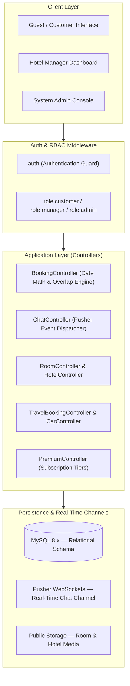
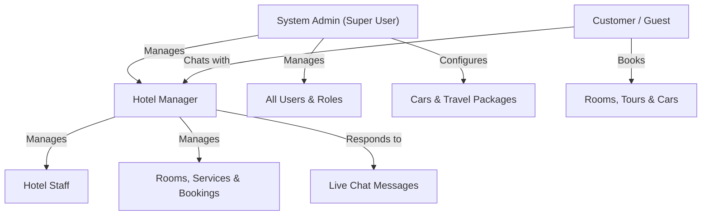

# 🏨 Hotel Booking & Hospitality Operations Platform

[](https://laravel.com)
[](https://www.php.net/)
[](https://www.mysql.com/)
[]()
[]()

> **A Laravel-based reservation platform with date-range conflict handling, real-time WebSocket communication, modular booking domains, and transactional pricing workflows — built with Laravel 12, PHP 8.2+, MySQL, Bootstrap 5, and Pusher WebSockets.**

---

## ⚡ Engineering Snapshot (60-Second Overview)

Hotel Booking Management is a reservation and hospitality platform focusing on date-range availability algorithms, transactional booking integrity, real-time messaging, and multi-domain reservation pipelines.

```
Key Engineering Focus Areas:
• Date-range room availability engine with mathematical booking overlap prevention
• Transactional reservation workflows with historical add-on price snapshotting
• Real-time bi-directional live chat communication using Pusher WebSockets
• Role-based route authorization across Customer, Manager, and Admin roles
• Modular multi-domain reservations (Hotel Rooms, Holiday Packages, Car Rentals)
• Tiered premium subscription system with automatic discount calculations during checkout
• Architectural artifacts included: DFD Level 0/1, ERD schema, and Laravel MVC workflow diagrams
```

---

## 📑 Table of Contents

1. [Platform Overview](#-platform-overview)
2. [System Architecture & Visual Diagrams](#-system-architecture--visual-diagrams)
3. [Engineering Decisions & Trade-offs](#-engineering-decisions--trade-offs)
4. [Implementation Status Matrix](#-implementation-status-matrix)
5. [Room Booking & Date Overlap Engine](#-room-booking--date-overlap-engine)
6. [Real-Time Live Chat Architecture](#-real-time-live-chat-architecture)
7. [Multi-Domain Reservation Workflows](#-multi-domain-reservation-workflows)
8. [Premium Subscription & Discount Engine](#-premium-subscription--discount-engine)
9. [Role-Based Access Control (RBAC)](#-role-based-access-control-rbac)
10. [Key Engineering Challenges & Solutions](#-key-engineering-challenges--solutions)
11. [Testing & Reliability](#-testing--reliability)
12. [Database Schema & Entity Relationships](#-database-schema--entity-relationships)
13. [Installation & Local Setup](#-installation--local-setup)
14. [Author & Contributions](#-author--contributions)

---

## 🏨 Platform Overview

```
┌─────────────────────────────────────────────────────────────────────────┐
│              Hotel Booking & Hospitality Platform                       │
├──────────────────────────┬─────────────────────────┬────────────────────┤
│    Customer Storefront   │     Manager Portal      │    Admin Console   │
├──────────────────────────┼─────────────────────────┼────────────────────┤
│ • Room Date Booking      │ • Room Inventory CRUD   │ • User Management  │
│ • Service Add-on Bundling│ • Booking Status Flow   │ • Manager Roles    │
│ • Travel & Tour Packages │ • Live Chat Inquiries   │ • System Settings  │
│ • Car Rental Booking     │ • Hotel Property Setup  │ • Travel Packages  │
│ • Real-Time Pusher Chat  │ • Service Catalogs      │ • Car Rental Fleet │
│ • Premium Tier Discounts │ • Operational Reports   │ • Premium Plans    │
└──────────────────────────┴─────────────────────────┴────────────────────┘
```

---

## 🏛️ System Architecture & Visual Diagrams

The application is architected following the **Laravel MVC** design pattern, complemented by WebSocket channels for real-time customer engagement:



> 📐 **Architectural Design Artifacts:** The repository includes complete SVG and Draw.io design diagrams:
> - [`hotel_booking_dfd_lvl0_corrected.svg`](./hotel_booking_dfd_lvl0_corrected.svg) — Data Flow Diagram (Level 0)
> - [`hotel_booking_dfd_lvl1_corrected.svg`](./hotel_booking_dfd_lvl1_corrected.svg) — Data Flow Diagram (Level 1)
> - [`hotel_booking_erd_corrected.svg`](./hotel_booking_erd_corrected.svg) — Entity Relationship Diagram (ERD)
> - [`laravel_mvc_structure.svg`](./laravel_mvc_structure.svg) — Laravel MVC Layered Architecture

---

## ⚖️ Engineering Decisions & Trade-offs

| Architectural Decision | Chosen Approach | Rationale & Trade-offs |
|---|---|---|
| **Real-time Live Chat** | Pusher WebSocket Channels | Avoids continuous client-side HTTP polling, reducing server request load while providing near-real-time message delivery without continuous polling. |
| **Date-Range Conflict Engine** | SQL Range Overlap Logic | Mathematical overlap check prevents conflicting reservations during room selection. |
| **Service Add-ons** | Relational Pivot Model (`BookingServices`) | Decouples add-on charges (spa, dining, airport pickup) from base room rates, preserving itemized billing auditability. |
| **Multi-Domain Isolation** | Separate Domain Models (`Booking`, `TravelBooking`, `CarBooking`) | Keeps distinct booking lifecycles and metadata structures modular while sharing customer authentication and payment logic. |
| **Role-Based Authorization** | Custom Role Middleware (`role:admin,manager`) | Centralizes access rules at the routing boundary rather than scattering authorization checks throughout controllers. |

---

## 🚦 Implementation Status Matrix

| Feature / Domain | Status | Technical Implementation Details |
|---|:---:|---|
| **Room Booking Engine** | ✅ **Implemented** | Date-range selection, nights calculation, and overlap prevention |
| **Add-on Services Bundling** | ✅ **Implemented** | Multi-service attachment with quantity and price snapshotting |
| **Real-Time Live Chat** | ✅ **Implemented** | Pusher WebSockets with database message persistence and unread flags |
| **Role-Based Authorization** | ✅ **Implemented** | Role-based middleware protecting Customer, Manager, and Admin routes |
| **Travel & Tour Packages** | ✅ **Implemented** | Package catalog, date scheduling, passenger limits, and bookings |
| **Car Rental Fleet** | ✅ **Implemented** | Vehicle inventory, daily rental rates, driver options, and bookings |
| **Premium Membership Plans** | ✅ **Implemented** | Silver (5%) and Gold (10%) discount tiers automatically applied at checkout |
| **Manager Booking Workflow** | ✅ **Implemented** | Status pipeline (`Pending` → `Confirmed` → `Completed` → `Cancelled`) |
| **Admin System Dashboard** | ✅ **Implemented** | Cross-property metrics, user role management, and fleet configuration |

---

## 🧩 5. Room Booking & Date Overlap Engine

### 1. Conflict Prevention Query
The reservation engine evaluates existing bookings for a requested room against incoming check-in and check-out dates using a mathematical range comparison:

$$\text{Overlap Condition: } (\text{Existing Check-in} < \text{Requested Check-out}) \land (\text{Existing Check-out} > \text{Requested Check-in})$$

```php
$isAvailable = !Booking::where('room_id', $roomId)
    ->whereIn('status', ['confirmed', 'pending'])
    ->where(function ($query) use ($checkIn, $checkOut) {
        $query->where('check_in_date', '<', $checkOut)
              ->where('check_out_date', '>', $checkIn);
    })->exists();
```

- **Dynamic Nights Calculation:** Automatically computes duration of stay and applies tiered room rates.
- **Booking Status State Machine:** `Pending` $\rightarrow$ `Confirmed` $\rightarrow$ `Completed` $\rightarrow$ `Rejected` / `Cancelled`.

---

## 💬 6. Real-Time Live Chat Architecture

- **WebSockets Infrastructure:** Powered by Pusher channels to facilitate instant messaging between guests and hotel staff.
- **Message Persistence:** All message payloads are stored in the database (`messages` table) with sender, receiver, and timestamp metadata.
- **Context-Aware Inquiries:** Chat threads can link directly to a specific `booking_id` for instant reservation context.

---

## 🚗 7. Multi-Domain Reservation Workflows

- **Hotel & Room Inventory:** Multi-property hotels with room types (Standard, Deluxe, Suite, Presidential) and JSON-casted amenities.
- **Holiday Travel Packages:** Curated tour itineraries with destination highlights, duration, pricing, and group capacity.
- **Car Rental Fleet:** Vehicle model, category (Sedan, SUV, Luxury), daily rate, and rental booking workflow.

---

## 💎 8. Premium Subscription & Discount Engine

- **Subscription Tiers:**
  - 🥈 **Silver Tier:** 5% automatic discount on all room and service bookings.
  - 🥇 **Gold Tier:** 10% automatic discount on all room and service bookings.
- **Automated Checkout Deduction:** Validates active subscription status at the checkout boundary and recalculates net payable amounts.

---

## 🔐 9. Role-Based Access Control (RBAC)



| Role | Access Permissions |
|---|---|
| **Customer** | Search rooms, select dates, bundle services, book travel/cars, live chat, subscribe to premium |
| **Manager** | Room & service CRUD, booking confirmation/rejection, live chat response, operational reports |
| **Admin** | Full system control, manager account provisioning, user role management, fleet & tour management |

---

## 💡 10. Key Engineering Challenges & Solutions

### Challenge 1: Date-Range Booking Conflict Prevention
**Problem:** Multiple customers selecting overlapping dates for the same room could create conflicting reservation attempts.

**Solution:** Booking creation is executed within a database transaction with date-overlap validation queries and status verification to prevent conflicting reservations before committing the record.

---

### Challenge 2: Synchronizing Multi-Party Live Chat
**Problem:** Guests requiring instant support needed a reliable communication channel without polling the server repeatedly.

**Solution:** Integrated Pusher WebSocket channels to broadcast message events in real time, while simultaneously storing message payloads in MySQL for permanent historical access and unread badge tracking.

---

### Challenge 3: Itemized Add-on Pricing with Historical Snapshotting
**Problem:** Room bookings frequently bundle dynamic add-ons (spa, meals, airport pickup). If service prices change in the catalog later, historical booking totals must remain unchanged.

**Solution:** Modeled add-ons through a `BookingServices` pivot table that stores unit price snapshots at the exact moment of booking, guaranteeing billing auditability over time.

---

## 🧪 11. Testing & Reliability

Key test coverage areas for system verification:

- **Date Overlap Validation:** Boundary testing for same-day checkout/check-in transitions and overlapping date ranges.
- **Add-on Price Snapshotting:** Verifies that modifying service catalog prices does not alter historical booking totals.
- **Subscription Discount Calculations:** Validates that Silver (5%) and Gold (10%) discounts compute accurately on combined room and service subtotals.
- **Role Middleware Protection:** Asserts unauthorized access attempts are blocked for protected Customer, Manager, and Admin routes.
- **Message Persistence:** Confirms chat messages save correctly to the database alongside real-time WebSocket dispatch.

```bash
# Run test suite
php artisan test
```

---

## 🗄️ 12. Database Schema & Entity Relationships

```
hotels
    └── rooms (JSON amenities, pricing, status)
            ├── bookings (check_in, check_out, total, status)
            │       ├── booking_services ── services (Add-ons)
            │       └── messages (Live Chat)
            └── users (roles: customer, manager, admin)
                    └── premium_subscriptions (Silver / Gold tiers)

travel_packages ── travel_bookings
cars ── car_bookings
contact_messages
```

---

## 💻 13. Tech Stack

| Layer | Technologies |
|---|---|
| **Backend Framework** | Laravel 12.x, PHP 8.2+ (MVC, Eloquent ORM, Middleware) |
| **Database** | MySQL 8.x (InnoDB, Foreign Key Constraints, Transactions) |
| **Real-time Engine** | Pusher WebSockets Channels |
| **Frontend UI** | Blade Templates, Bootstrap 5, Vanilla JavaScript ES6+ |
| **Authentication** | Session-based Auth with Custom Role Middleware |
| **Tooling** | Composer, NPM, Vite, Artisan CLI |

---

## 🚀 14. Installation & Local Setup

### Prerequisites
- PHP `>= 8.2`
- Composer `>= 2.x`
- Node.js & NPM
- MySQL `>= 8.0`
- Pusher Account Credentials (for real-time chat)

### Step-by-Step Setup

1. **Clone the repository:**
   ```bash
   git clone https://github.com/ShakhawatSakib9/Hotel-Booking-Management.git
   cd Hotel-Booking-Management
   ```

2. **Install Dependencies:**
   ```bash
   composer install
   npm install
   ```

3. **Configure Environment:**
   ```bash
   cp .env.example .env
   php artisan key:generate
   ```

4. **Configure Database & Pusher in `.env`:**
   ```env
   DB_CONNECTION=mysql
   DB_HOST=127.0.0.1
   DB_PORT=3306
   DB_DATABASE=hotel_booking
   DB_USERNAME=root
   DB_PASSWORD=

   PUSHER_APP_ID=your_pusher_app_id
   PUSHER_APP_KEY=your_pusher_app_key
   PUSHER_APP_SECRET=your_pusher_app_secret
   PUSHER_APP_CLUSTER=mt1
   ```

5. **Run Migrations & Seeders:**
   ```bash
   php artisan migrate --seed
   ```

6. **Compile Assets & Launch Server:**
   ```bash
   npm run build
   php artisan serve
   ```
   - Application URL: `http://127.0.0.1:8000`

---

## 👨‍💻 15. Author & Contributions

**Developed by Shakhawat Sakib**  
*Full-Stack Software Engineer · Laravel · PHP · MySQL · WebSockets*

- Portfolio: [github.com/ShakhawatSakib9](https://github.com/ShakhawatSakib9)
- LinkedIn: [linkedin.com/in/shakhawat-sakib](https://linkedin.com)
